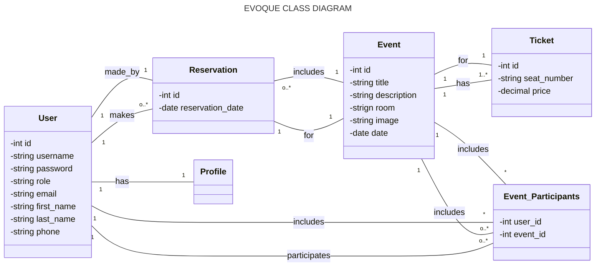

# Application de Gestion d'Événements en Ligne

## Introduction

Pour un projet pédagogique utilisant Spring Boot, Angular, Bootstrap, et TailWind, j'ai développé une application de gestion d'événements en ligne. Ce projet inclut la gestion des comptes utilisateurs et administrateurs, ainsi que diverses relations entre les tables de la base de données. Voici une description détaillée des fonctionnalités, de l'architecture, et des ressources utilisées.

### Fonctionnalités

#### Gestion des utilisateurs

- Inscription et authentification des utilisateurs.
- Gestion des rôles (utilisateur et administrateur).
- Mise à jour du profil utilisateur.

#### Gestion des événements

- Création, modification, et suppression d'événements par les administrateurs.
- Affichage des détails d'un événement.
- Ajout d'utilisateurs aux événements.

#### Réservations et tickets

- Réservation de places par les utilisateurs.
- Gestion des réservations et des tickets par les administrateurs.
- Affichage de l'historique des réservations pour chaque utilisateur.
- Notifications pour les événements à venir et les changements.

#### Interface utilisateur

- Utilisation de Bootstrap et TailWind pour un design responsive et moderne.
- Tableau de bord pour les administrateurs avec statistiques sur les événements et les réservations.
- Interface utilisateur intuitive pour la recherche et la réservation de tickets.

### Architecture

#### Backend : Spring Boot

- Gestion des utilisateurs et authentification (Spring Security).
- API RESTful pour la gestion des événements, des réservations et des tickets.
- Interaction avec PostgreSQL pour la persistance des données.

#### Frontend : Angular

- Consommation des API REST du backend.
- Utilisation de Bootstrap et TailWind pour le design.

#### Base de données : PostgreSQL

- Schéma de la base de données pour les utilisateurs, les événements, les réservations et les tickets.

### Relations entre les Tables

1. **One-to-One :**
    - Chaque utilisateur a un profil unique.

2. **Many-to-One :**
    - Plusieurs réservations peuvent être associées à un événement unique.

3. **One-to-Many :**
    - Un événement peut avoir plusieurs tickets associés.

4. **Many-to-Many :**
    - Un utilisateur peut participer à plusieurs événements et un événement peut avoir plusieurs participants.

### Exemple de Schéma de Base de Données

Voici un exemple simplifié de schéma pour PostgreSQL avec les relations demandées.

```sql
-- Table pour les utilisateurs
CREATE TABLE users (
    id SERIAL PRIMARY KEY,
    username VARCHAR(50) UNIQUE NOT NULL,
    password VARCHAR(255) NOT NULL,
    role VARCHAR(20) NOT NULL CHECK (role IN ('USER', 'ADMIN')),
    email VARCHAR(100) NOT NULL
);

-- Table pour les profils utilisateur (One-to-One)
CREATE TABLE profiles (
    id SERIAL PRIMARY KEY,
    user_id INTEGER UNIQUE REFERENCES users(id),
    first_name VARCHAR(50),
    last_name VARCHAR(50),
    phone VARCHAR(20),
    address VARCHAR(255)
);

-- Table pour les événements
CREATE TABLE events (
    id SERIAL PRIMARY KEY,
    name VARCHAR(255) NOT NULL,
    description TEXT,
    event_date DATE NOT NULL,
    location VARCHAR(255) NOT NULL
);

-- Table pour les réservations (Many-to-One)
CREATE TABLE reservations (
    id SERIAL PRIMARY KEY,
    user_id INTEGER REFERENCES users(id),
    event_id INTEGER REFERENCES events(id),
    reservation_date DATE NOT NULL
);

-- Table pour les tickets (One-to-Many)
CREATE TABLE tickets (
    id SERIAL PRIMARY KEY,
    event_id INTEGER REFERENCES events(id),
    seat_number VARCHAR(20),
    price DECIMAL(10, 2) NOT NULL
);

-- Table de liaison pour les participations (Many-to-Many)
CREATE TABLE event_participants (
    user_id INTEGER REFERENCES users(id),
    event_id INTEGER REFERENCES events(id),
    PRIMARY KEY (user_id, event_id)
);
```
